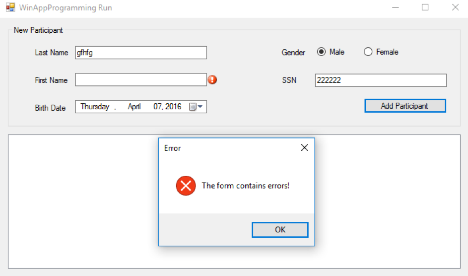
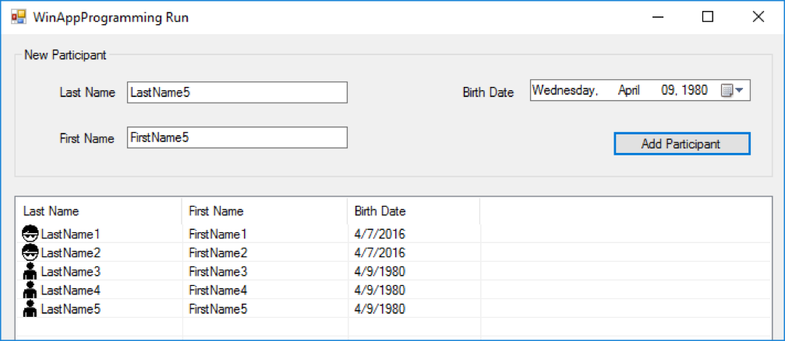
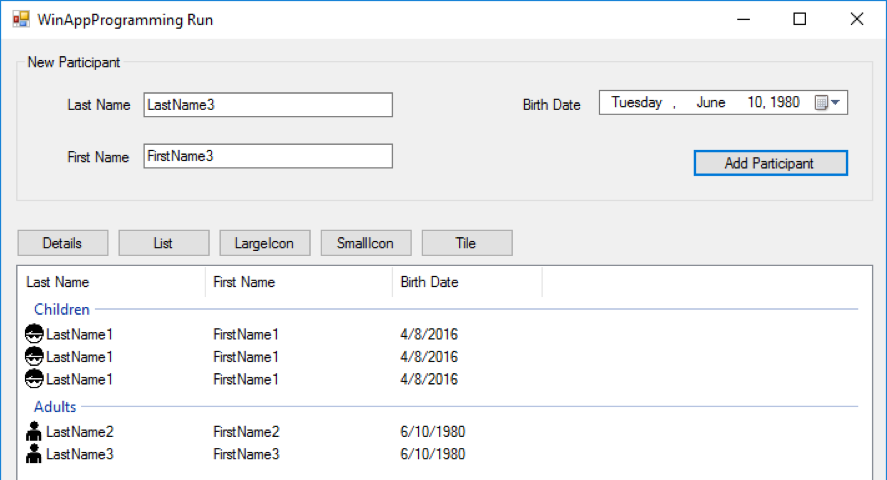
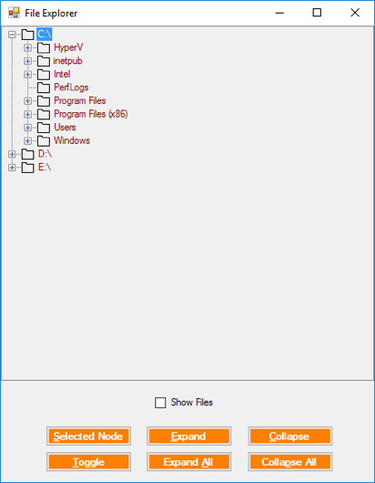
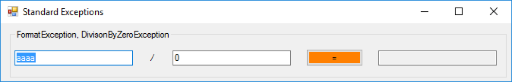

# Windows Forms – Validation, Exceptions, ListView, TreeView

<!-- vscode-markdown-toc -->
* 1. [Objectives](#Objectives)
* 2. [Data Validation](#DataValidation)
* 3. [Complex Visualization Controls](#ComplexVisualizationControls)
	* 3.1. [ ListView](#ListView)
	* 3.2. [ TreeView](#TreeView)
* 4. [ Exception Handling](#ExceptionHandling)
	* 4.1. [ Custom Exceptions](#CustomExceptions)
	* 4.2. [ Standard Exceptions](#StandardExceptions)
* 5. [Bibliography](#Bibliography)

<!-- vscode-markdown-toc-config
	numbering=true
	autoSave=true
	/vscode-markdown-toc-config -->
<!-- /vscode-markdown-toc -->

##  1. <a name='Objectives'></a>Objectives

##  2. <a name='DataValidation'></a>Data Validation

**Assignment**

 Sample Code available – Check the “ValidationCustomExceptions” Sample

1. Create a new project with the name “ValidationCustomExceptions”
2. Create the following UI:  

3. Add an `ErrorProvider` and name it `errorProvider`.
4. Add a method for validating the "Last Name" as follows:
	```C#
	private bool IsLastNameValid()
	{
		return string.IsNullOrWhiteSpace(tbLastName.Text.Trim());
	}
	```
4. Handle the **Validating** event on **tbLastName** as follows:

	```c#
	if (!IsLastNameValid())
	{
		e.Cancel = true; //prevents the user from changing the focus to another control
		errorProvider.SetError((Control)sender, "Last Name is empty!");
	}
	```
5. Handle the **Validated** event on **tbLastName** as follows:

	```c#
	//https://docs.microsoft.com/en-us/dotnet/api/system.windows.forms.errorprovider.clear
	errorProvider.SetError((Control)sender, string.Empty);
	```
6. (optional) Set `AutoValidate` form property to `EnableAllowFocusChange` in order to allow the user to change the focus to a different control or to close the form.
6. Handle the **Validating** and **Validated** events for the **tbFirstName** in a similar manner
7. Handle the **Click** event on the “Add Participant” button as follows

	```c#
	private void btnAdd_Click(object sender, EventArgs e)
	{
		//https://docs.microsoft.com/en-us/dotnet/api/system.windows.forms.containercontrol.validatechildren
		if (!ValidateChildren())
		{
			//An ErrorProvider control should
			MessageBox.Show("The form contains errors!",
				"Error",
				MessageBoxButtons.OK,
				MessageBoxIcon.Error);

			return;
		}
	}
	```
8.	Why is it recommended to have the validations both on the individual controls and in the handler for the “Add Participant” button?

##  3. <a name='ComplexVisualizationControls'></a>Complex Visualization Controls

###  3.1. <a name='ListView'></a> ListView

**Assignment**

 Sample Code avilable – Check the “ListViewSample” Sample

1. Create a new project with the name “ListViewSample”
2. Rename “Form1” to “MainForm”
3. Create the following UI:    

4. Add a new folder to your project and name it “Entities”
5. Inside the “Entities” folder add the following “Participant” class:

	```c#
	internal class Participant
	{
		public string LastName { get; set; }
		public string FirstName { get; set; }
		public DateTime BirthDate { get; set; }


		public Participant(string lastName, string firstName, DateTime 	birthDate)
		{
			LastName = lastName;
			FirstName = firstName;
			BirthDate = birthDate;
		}
	}
	```
6. Final form of the “MainForm” class
	
	```c#
	public partial class MainForm : Form
	{
		#region Properties
		private List<Participant> Participants { get; set; }
		#endregion

		public MainForm()
		{
			InitializeComponent();

			Participants = new List<Participant>();
		}

		public void DisplayParticipants()
		{
			lvParticipants.Items.Clear();

			foreach (Participant participant in Participants)
			{
				var listViewItem = new ListViewItem(participant.LastName);
				listViewItem.SubItems.Add(participant.FirstName);
				listViewItem.SubItems.Add(participant.BirthDate.ToShortDateString());

				//approximate calculation of the age 
				if ((DateTime.Now - participant.BirthDate).TotalDays / 365 >= 18)
					listViewItem.ImageKey = "adult.png";
				else
					listViewItem.ImageKey = "child.png";

				lvParticipants.Items.Add(listViewItem);
			}
		}

		#region Events
		private void btnAdd_Click(object sender, EventArgs e)
		{
			string firstName = tbFirstName.Text;
			string lastName = tbLastName.Text;
			DateTime birthDate = dtpBirthDate.Value;

			var participant = new Participant(lastName, firstName, birthDate);
			Participants.Add(participant);

			DisplayParticipants();
		}
		#endregion
	}
	```
7. Add buttons for changing the current “View” of the list, as shown:  

8. Display the participants in groups (“Children” and “Adults”) as in the previous image

**Homework**
1. Also clear/reset the values in the textboxes and in the DateTimePicker when the user clicks the "Add Participant" button  

###  3.2. <a name='TreeView'></a> TreeView

**Assignment**

 Sample Code available – Check the “TreeViewSample” Sample

1. Create a new project with the name “TreeViewSample”
2. Create the following UI:  

3. Add the following methods:

	```c#
	 #region Methods
	private void FillDirectoryTree()
	{
		//  Suppress redraw until tree view is complete
		tvw.BeginUpdate();

		//  First clear all the nodes.
		tvw.Nodes.Clear();

		//  Get the logical drives and put them into the root nodes.
		//  Fill an array with all the logical drives on the machine.
		string[] strDrives = Environment.GetLogicalDrives();

		//  Iterate through the drives, adding them to the tree.
		//  Use a try/catch block, so if a drive is not ready, 
		//  e.g. an empty floppy or CD, it will not be added to the tree.
		foreach (string rootDirectoryName in strDrives)
		{
			try
			{
				//  Find all the first level subdirectories.
				//  If the drive is not ready, this will throw an 
				//  exception, which will have the effect of 
				//  skipping that drive.
				Directory.GetDirectories(rootDirectoryName);

				//  Create a node for each root directory
				TreeNode ndRoot = new TreeNode(rootDirectoryName);

				//  Add the node to the tree
				tvw.Nodes.Add(ndRoot);

				//  Add subdirectory nodes.
				//  If Show Files checkbox checked, then also get the filenames.
				GetSubDirectoryNodes(ndRoot, cb.Checked);
			}
			catch (IOException)
			{
				//  let it through
			}
			catch (Exception e)
			{
				//  Catch any other errors.
				MessageBox.Show(e.Message);
			}
		}

		tvw.EndUpdate();

	}

	private void GetSubDirectoryNodes(TreeNode parentNode, bool getFileNames)
	{
		//  Exit this method if the node is not a directory.
		DirectoryInfo di = new DirectoryInfo(parentNode.FullPath);
		if ((di.Attributes & FileAttributes.Directory) == 0)
		{
			return;
		}

		//  Clear all the nodes in this node.
		parentNode.Nodes.Clear();

		try
		{
			//  Get an array of strings containing all the subdirectories in the parent node.
			string[] arSubs = Directory.GetDirectories(parentNode.FullPath);

			//  Add a child node for each subdirectory.
			foreach (var subDir in arSubs)
			{
				DirectoryInfo dirInfo = new DirectoryInfo(subDir);
				// do not show hidden folders
				if ((dirInfo.Attributes & FileAttributes.Hidden) != 0)
				{
					continue;
				}

				TreeNode subNode = new TreeNode(dirInfo.Name);
				subNode.ImageIndex = 0;
				subNode.SelectedImageKey = "openFolder.png";
				parentNode.Nodes.Add(subNode);
			}

			if (getFileNames)
			{
				//  Get any files for this node.
				string[] files = Directory.GetFiles(parentNode.FullPath);

				// After placing the nodes, 
				// now place the files in that subdirectory.
				foreach (string str in files)
				{
					FileInfo fi = new FileInfo(str);
					TreeNode fileNode = new TreeNode(fi.Name);
					parentNode.Nodes.Add(fileNode);

					//  Set the icon
					switch (fi.Extension.ToUpper())
					{
						case ".JPG":
						case ".JPEG":
							fileNode.ImageKey = "jpgFile.png";
							fileNode.SelectedImageKey = "jpgFile.png";
							break;
						case ".TXT":
							fileNode.ImageKey = "textFile.png";
							fileNode.SelectedImageKey = "textFile.png";
							break;
						default:
							fileNode.ImageKey = "file.png";
							fileNode.SelectedImageKey = "file.png";
							break;
					}
				}
			}
		}
		catch (UnauthorizedAccessException)
		{

		}
	}
	#endregion
	```

##  4. <a name='ExceptionHandling'></a> Exception Handling

###  4.1. <a name='CustomExceptions'></a> Custom Exceptions

**Assignment**

 Sample Code available – Check the “ValidationCustomExceptions” Sample

1. Add the following “InvalidBirthDateException” class:

	```c#
	public class InvalidBirthDateException : Exception
	{
		public DateTime BirthDate { get; set; }

		public InvalidBirthDateException(DateTime birthDay)
		{
			BirthDate = birthDay;
		}

		public override string Message
		{
			get
			{
				return "The birthDate " + BirthDate + " is invalid";
			}
		}
	}
	```
2. Update the “BirthDate” property in the “Participant” class in order to validate the received value:

	```c#
	#region BirthDate
	private DateTime _birthDate;
	public DateTime BirthDate {
		get { return _birthDate; }
		set
		{
			if(value >= DateTime.Today)
				throw new InvalidBirthDateException(value);
			_birthDate = value;
		}
	}
	#endregion
	```
3. Update the event handler for the “Add Participant” button in order to handle the potential exceptions:

	```c#
	try
	{
		var participant = new Participant(lastName, firstName, birthDate, gender, ssn);
		//TODO Logic for adding the participant to the list bellow
	}
	catch (InvalidBirthDateException ex)
	{
		//Expected exception
		MessageBox.Show(string.Format("The birth date {0} is invalid!", ex.BirthDate));
	}
	catch (Exception)
	{
		//UnExpected exception
		MessageBox.Show("An exception has been encountered! Please contact the technical support.");

		//Log the exception using:
		// - Log4Net
		// - Application Insights
	}
	finally
	{
		Debug.WriteLine("Always executed");
	}
	```

###  4.2. <a name='StandardExceptions'></a> Standard Exceptions

* common exception types: System.NotImplementedException, [System.DivideByZeroException](https://msdn.microsoft.com/en-us/library/system.dividebyzeroexception%28v=vs.110%29.aspx), System. FormatException

 Further reading: [link](https://msdn.microsoft.com/en-us/library/ms173160.aspx)

**Assignment**

1. Create a new project with the name “StandardExceptions”
2. Create the following UI:  

3. Handle the possible exceptions

	```c#
	 try
	{
		int value1 = int.Parse(tbValue1.Text);
		int value2 = int.Parse(tbValue2.Text);

		tbResult.Text = (value1/	value2).ToString(CultureInfo.InvariantCulture);

		//Throwing an exception:
		//throw new NotImplementedException();
	}
	catch (FormatException ex)
	{
		MessageBox.Show(ex.Message);

		//Rethrowing the exception
		//throw; //Handled by Program.Application_ThreadException
	}
	catch (DivideByZeroException ex)
	{
		MessageBox.Show(ex.Message);
	}
	catch (Exception ex)
	{
		MessageBox.Show(ex.Message);
	}
	```
4.	Catching all uncaught exceptions in an application can be done by subscribing to the “ThreadException” event in the “Program” class

	```c#
	static class Program
	{
		/// <summary>
		/// The main entry point for the application.
		/// </summary>
		[STAThread]
		static void Main()
		{
			Application.ThreadException += Application_ThreadException;

			Application.EnableVisualStyles();
			Application.SetCompatibleTextRenderingDefault(false);
			Application.Run(new MainForm());
		}

		private static void Application_ThreadException(object sender, System.Threading.ThreadExceptionEventArgs e)
		{
			MessageBox.Show(e.Exception.Message);
		}
	}
	```

##  5. <a name='Bibliography'></a>Bibliography
- ErrorProvider Class: https://docs.microsoft.com/en-us/dotnet/api/system.windows.forms.errorprovider
- How to: Display Error Icons for Form Validation with the Windows Forms ErrorProvider Component: https://docs.microsoft.com/en-us/dotnet/framework/winforms/controls/display-error-icons-for-form-validation-with-wf-errorprovider