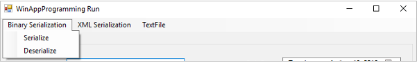

# Windows Forms – Serialization, Text Files

<!-- vscode-markdown-toc -->
* 1. [Objectives](#Objectives)
* 2. [Serialization/Deserialization](#SerializationDeserialization)
	* 2.1. [Binary Serialization](#BinarySerialization)
	* 2.2. [XML Serialization](#XMLSerialization)
* 3. [ TextFiles](#TextFiles)
* 4. [Bibliography](#Bibliography)

<!-- vscode-markdown-toc-config
	numbering=true
	autoSave=true
	/vscode-markdown-toc-config -->
<!-- /vscode-markdown-toc -->

##  1. <a name='Objectives'></a>Objectives
- implement `binary` serialization / deserialization;
- implement `XML` serialization / deserialization;
- implement `JSON` serialization / deserialization;
- understand the differences between the `binary`, `XML` and `JSON` serializations;
- writing text files;
- uising the `OpenFileDialog` and the `SaveFileDialog`.

##  2. <a name='SerializationDeserialization'></a>Serialization/Deserialization

**Documentation**
- Serialization in .NET: <https://docs.microsoft.com/en-us/dotnet/standard/serialization/>

**Activity**

> :octocat: The complete sample is available in the "code samples" folder:  “SerializationBinaryXMLTextFile”

1.  Create a copy of the “ListViewBasicSample” project and name it “SerializationBinaryXMLTextFile”

2.  Create the following UI

	

###  2.1. <a name='BinarySerialization'></a>Binary Serialization

3. Add a menu for “Binary Serialization” (“Serialize” - `btnSerializeBinary`, “Deserialize” - `btnDeserializeBinary`), “XML Serialization” (“Serialize” - `btnSerializeXML`, “Deserialize” - `btnDeserializeXML`) and “TextFile” (“Export” – `btnExport`). 

4. Decorate the `Participant` class with the `[Serializable]` attribute, as follows. An exception will be thrown otherwise.

	```c#
	[Serializable]
	internal class Participant
	{
	…………………
	```
     	
5.  Handle the `Click` event for the `btnSerializeBinary` button as follows

	```c#
	private void btnSerialize_Click(object sender, EventArgs e){
		BinaryFormatter formatter = new BinaryFormatter();
		using (FileStream stream = File.Create("serialized.bin"))
			formatter.Serialize(stream, _participants);
	}
	```

6. Check what happens when the `using` statement is compiled.  
   > `using` statement: https://docs.microsoft.com/en-us/dotnet/csharp/language-reference/keywords/using-statement
     	     	
7. Remove the `readonly` modifier from the declaration of the `_participants` attribute in the `MainForm` class. The project will not compile otherwise.

8. Handle the `Click` event for the `btnDeserializeBinary` button as follows

	```C#
	private void btnDeserialize_Click(object sender, EventArgs e){
		BinaryFormatter formatter = new BinaryFormatter();
		using (FileStream stream = File.OpenRead("serialized.bin"))	{
			_participants = (List<Participant>)formatter.Deserialize(stream);
			DisplayParticipants();
		}
	}
	```
**Assignments (for you to try)**
1. Modify the project in order to automatically serialize the current list of participants when the application is closed. The list should be automatically deserialized and displayed when the application starts. The application should not throw an exception if the serialization file has been deleted in the mean time.

###  2.2. <a name='XMLSerialization'></a>XML Serialization

8. Add a parameterless constructor to the `Participant` class. Change the access modifier for the class from `internal` to `public`. An exception will be thrown otherwise.

9. Handle the `Click` event for the `btnSerializeXML` button as follows.

	```C#
	XmlSerializer serializer = new XmlSerializer(typeof(List<Participant>));

	using (FileStream stream = File.Create("SerializedXML.xml"))
		serializer.Serialize(stream, _participants);
	```

10. Handle the `Click` event for the `btnDeserializeXML` button as follows.

	```C#
	XmlSerializer serializer = new XmlSerializer(typeof(List<Participant>));
	
	using (FileStream stream = File.OpenRead("SerializedXML.xml"))
	{
		_participants = (List<Participant>)serializer.Deserialize(stream);
		DisplayParticipants();
	}
	```

**Assignments (for you to try)**
1. Also implement JSON serialization using the NuGet package available at: https://www.nuget.org/packages/Newtonsoft.Json/ .
2. Add at least 10 entries in the application. Serialize the data in Binary, XML and JSON format. Compare the sizes of the resulting files. Open the files using Notepad (or any other text editor) and compare their content. 


##  3. <a name='TextFiles'></a> TextFiles

11. Handle the `Click` event for the `btnExport` button as follows

	> Further details about the CSV file format: https://en.wikipedia.org/wiki/Comma-separated_values

	```c#
	// Create an instance of the open file dialog box.
	SaveFileDialog saveFileDialog = new SaveFileDialog();
	saveFileDialog.Filter = "Text File | *.txt";
	saveFileDialog.Title = "Save as text file";

	if (saveFileDialog.ShowDialog() == DialogResult.OK)
	{
		//Approach 1
		//StreamWriter sw = new StreamWriter(saveFileDialog.FileName);
		//try
		//{
		//	sw.WriteLine("LastName,FirstName,BirthDate");

		//	foreach (var participant in _participants)
		//	{
		//		sw.WriteLine("{0}, {1}, {2}"
		//			, participant.LastName
		//			, participant.FirstName
		//			, participant.BirthDate.ToShortDateString());
		//	}
		//}
		//finally
		//{
		//	sw.Dispose();
		//}

		//2. Approach 2 - recommended
		// When compiled, this code in this approach is converted to: try{} finally{}
		using (StreamWriter sw = File.CreateText(saveFileDialog.FileName))
		// Equivalent to:
		// using (StreamWriter sw = new StreamWriter(saveFileDialog.FileName))
		{
			sw.WriteLine("LastName,FirstName,BirthDate");

			foreach (var participant in _participants)
			{
				sw.WriteLine("\"{0}\", \"{1}\", \"{2}\""
                            , participant.LastName.Replace("\"", "\"\"")
							, participant.FirstName.Replace("\"", "\"\"")
                            , participant.BirthDate.ToShortDateString());
			}
		}
	}
	```
**Assignments (for you to try)**
1. Also allow the user the save the file using the *.csv file format.
   > `SaveFileDialog`: https://docs.microsoft.com/en-us/dotnet/api/system.windows.forms.savefiledialog
2. Add the option to import new participants from a *.csv or *.txt file selected using an OpenFileDialog. The participants imported from the text file should be added to the list of existing participants in the application. Note: The *csv file can be created using either any text editor or using Excel


**Activity**

> :octocat: The complete sample is available in the "code samples" folder: “TextFileSample”

1. Check the following application that is writting the names of all the directories in the `C:` drive to a text file 

	```C#
	static void Main(string[] args)
	{
		// Get the directories currently on the C drive.
		DirectoryInfo[] cDirs = new DirectoryInfo(@"c:\").GetDirectories();

		// Write each directory name to a file.
		using (StreamWriter sw = new StreamWriter("CDriveDirs.txt"))
		{
			foreach (DirectoryInfo dir in cDirs)
			{
				sw.WriteLine(dir.Name);
			}
		}

		// Read and show each line from the file.
		string line = "";
		using (StreamReader sr = new StreamReader("CDriveDirs.txt"))
		{
			while ((line = sr.ReadLine()) != null)
			{
				Console.WriteLine(line);
			}
		}
	}
	```
**Activity**
1. Try to implement an application similar to the `Windows Folder Organizer` available in the `Microsoft Store`.
 
##  4. <a name='Bibliography'></a>Bibliography
- https://docs.microsoft.com/en-us/dotnet/standard/serialization/
