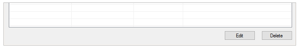
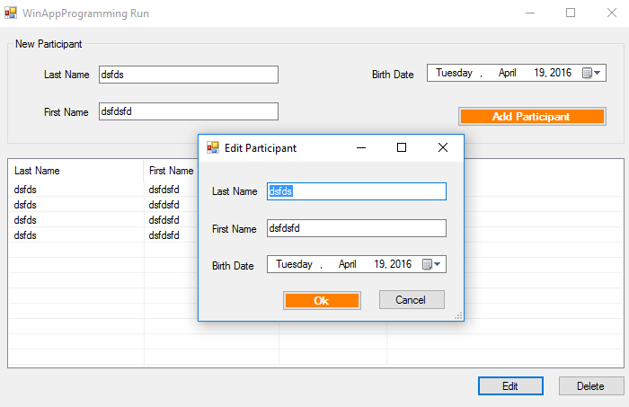
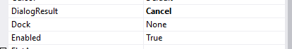
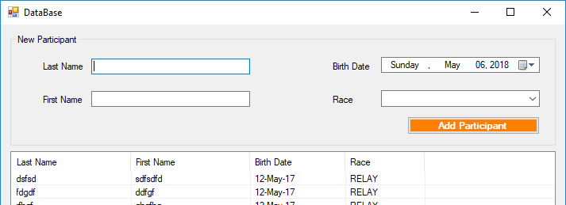

# Windows Forms – Dialogs
<!-- vscode-markdown-toc -->
* 1. [Objectives](#Objectives)
* 2. [MessageBox and DialogResult](#MessageBoxandDialogResult)
* 3. [Secondary Dialog](#SecondaryDialog)
* 4. [Assignments (for you to try)](#Assignmentsforyoutotry)
* 5. [Bibliography](#Bibliography)

<!-- vscode-markdown-toc-config
	numbering=true
	autoSave=true
	/vscode-markdown-toc-config -->
<!-- /vscode-markdown-toc -->

##  1. <a name='Objectives'></a>Objectives
- open a modal or modeless dialog;
- share data between the main form and the secondary form.

##  2. <a name='MessageBoxandDialogResult'></a>MessageBox and DialogResult

**Activity**

> :octocat: Full source code available, check the `DialogSample` sample.

1. Create a copy of the “ListViewBasicSample” project and name it “DialogSample”

2. Create the following UI



3. Name the “Edit” button “btnEdit” and the “Delete” button “btnDelete”

4. Modify the “DisplayParticipants” method in the “MainForm” class in order to set the “Tag” property for the ListViewItem instances, as shown bellow.

	```c#
	private void DisplayParticipants()
	{
		lvParticipants.Items.Clear();

		foreach (Participant participant in _participants)
		{
			var listViewItem = new ListViewItem(participant.LastName);
			listViewItem.SubItems.Add(participant.FirstName);
			listViewItem.SubItems.Add(participant.BirthDate.ToShortDateString());
			
			//add this line
			listViewItem.Tag = participant;
			
			lvParticipants.Items.Add(listViewItem);
		}
	}
	```

5. Handle the `Click` event for the `btnDelete` button as follows

	```c#
	if (lvParticipants.SelectedItems.Count == 0)
	{
		MessageBox.Show("Choose a participant");
		return;
	}

	if (MessageBox.Show("Are you sure?", "Delete participant", MessageBoxButtons.YesNo, MessageBoxIcon.Warning) == DialogResult.Yes)
	{
		_participants.Remove((Participant) lvParticipants.SelectedItems[0].Tag);
		DisplayParticipants();
	}
	```

##  3. <a name='SecondaryDialog'></a>Secondary Dialog

6. Add a new Form to the project and name it `EditForm`

7. Create the following UI

	

8. Rename the controls as “tbLastName”, “tbFirstName” and “dtpBirthDate”

9. Change the EditForm class, so that it is defined as follow

	```c#
	#region Attributes
	private readonly Participant _participant;
	#endregion


	public EditForm(Participant participant)
	{
		_participant = participant;
		InitializeComponent();
	}
	private void EditForm_Load(object sender, System.EventArgs e)
	{
		tbLastName.Text = _participant.LastName;
		tbFirstName.Text = _participant.FirstName;
		dtpBirthDate.Value = _participant.BirthDate;
	}
	```

10. Set the DialogResult for the “Cancel” button as “Cancel”

	

11. Rename the “Ok” button as “btnOk”

12. Set the DialogResult for the “Ok” button as “OK”

	

13. Handle the “Click” event for the “btnOk” button as follows

	```c#
	_participant.LastName = tbLastName.Text;
	_participant.FirstName = tbFirstName.Text;
	_participant.BirthDate = dtpBirthDate.Value;
	```

14. Handle the “Click” event for the “Edit” button in the “MainForm” as follows:

	```c#
	if (lvParticipants.SelectedItems.Count == 0)
	{
		MessageBox.Show("Choose a participant");
		return;
	}

	EditForm editForm = new EditForm((Participant)lvParticipants.SelectedItems[0].Tag);
	if (editForm.ShowDialog() == DialogResult.OK)
		DisplayParticipants();
	```

##  4. <a name='Assignmentsforyoutotry'></a>Assignments (for you to try)
1. Besides the “Edit” button, also allow the user to edit the participants by double clicking on them in the `ListView`.
2. Display a contextual menu when the user right clicks on a participant in the `ListView`. The contextual menu will include the options to edit or delete the participant.
3. Remove the `GroupBox` previously used for adding new participants from the `MainForm`. Replace it instead with a button that will use the `EditForm` in order to add new participants.
4. Allow the user to choose the race in which the user is going to participate as shown below. Try a simple implementation in which the race is stored as a `string` in the `Participant` class. Afterwards, try a more complicated implementation by defining  a `Race` class. The `Participant` class will include in this case a property of the type `Race`.
	
5. Replace the `ListView` control used in the `MainForm` with a `DataGridView` control. Make sure that the edit and delete functionalities work correctly.
	>Hint: Use can use the `Rows` property of the `DataGridView` instead of `Items` property of the `ListView`

##  5. <a name='Bibliography'></a>Bibliography
- DataGridView class: https://docs.microsoft.com/en-us/dotnet/api/system.windows.forms.datagridview
- ListView class: https://docs.microsoft.com/en-us/dotnet/api/system.windows.forms.listview
