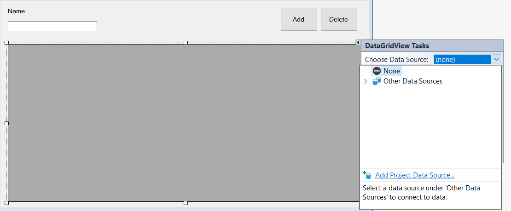
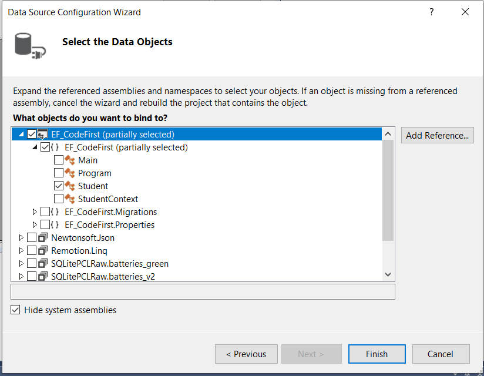

# Windows Forms – Entity Framework

# Objectives
 1. perform CRUD (Create, Read, Update and Delete) operations using the code first approach;
 2. perform CRUD (Create, Read, Update and Delete) operations using the database first approach;
    
# Documentation
 Entity Framework is an object-relational mapper (O/RM) that enables .NET developers to work with a database using .NET objects. It eliminates the need for most of the data-access code that developers usually need to write.

 It reduces the need for managing database connections, manually mapping datatables or writing stored procedures.
 Approaches supported:
  1. Code First (create the domain classes and EntityFramework would generate the database tables)                                       
  2. Database First (create the database tables and EntityFramework would generate the classes that match the tables)

# Assigments (solved)
# Code First
For this lecture we will use an SQLite database instance.

Prerequisites
 1. Open the download page https://www.sqlite.org/download.html and download the command-line shell program.
sqlite-tools-win32-x86-3270200.zip
A bundle of command-line tools for managing SQLite database files, including the command-line shell program, the sqldiff.exe program, and the sqlite3_analyzer.exe program.

 2. Unzip the archive and place its content somewhere convenient for further use.

Steps:
1. Create a new Windows Forms application.

2. Provide the following layout.


3. Create a class Student that has 3 attributes: Id (int), Name (string) and ProficientIn (string).

4. From NuGet Packet Manager install:
 * Microsoft.EntityFrameworkCore --> core functions of Entity Framework
 * Microsoft.EntityFrameworkCore.Sqlite --> database provider for SQLite
 * Microsoft.EntityFrameworkCore.Tools --> used for migrations (generating the database from the classes)
 
5. Rebuild the project.

6. Create a new class called StudentContext.
    ```C#
    public class StudentContext : DbContext
    {
        public StudentContext()
        {
            try
            {
                Database.Migrate();
            }
            catch(Exception)
            {
                Console.WriteLine("Database already exists." +
                    " No additional migration have to be applied.");
            }
        }

        public DbSet<Student> Students { get; set; }

        protected override void OnConfiguring(DbContextOptionsBuilder optionsBuilder)
        {
            optionsBuilder.UseSqlite("Data Source=students.db");
        }
    }
    ```
  
7. From Package Manager Console run the following command: **Add-Migration StudentMigration**
  
8. Set the binding for the DataGridView.
    
  
    
  
    
  
9. Assure you have the following methods implemented in your Main class.
    
    ```C#
    public partial class Main : Form
    {
        StudentContext ctx;
        public Main()
        {
            InitializeComponent();
            ctx = new StudentContext();
        }

        private void bAdd_Click(object sender, EventArgs e)
        {
            if (dgv.SelectedRows.Count != 0)
            {
                Student target = studentBindingSource.Current as Student;
                target.Name = tbName.Text;
                ctx.Students.Update(target);
            }
            else
            {
                ctx.Students.Add(new Student() { Name = tbName.Text });
            }
            ctx.SaveChanges();

            studentBindingSource.DataSource = ctx.Students.ToList();
        }

        private void Main_Load(object sender, EventArgs e)
        {
            studentBindingSource.DataSource = ctx.Students.ToList();
        }

        private void bDelete_Click(object sender, EventArgs e)
        {
            if (dgv.SelectedRows.Count != 0)
            {
                if (MessageBox.Show("Are you sure?", "Delete entry", MessageBoxButtons.YesNo, MessageBoxIcon.Question) == DialogResult.Yes)
                {
                    ctx.Students.Remove(studentBindingSource.Current as Student);
                    ctx.SaveChanges();

                    studentBindingSource.DataSource = ctx.Students.ToList();
                }
            }
        }

        private void dgv_MouseDoubleClick(object sender, MouseEventArgs e)
        {
            if (e.Button == MouseButtons.Left && dgv.SelectedRows.Count != 0)
            {
                tbName.Text = dgv.SelectedRows[0].Cells[1].Value.ToString();
            }
        }
    }
    ```
    
# Assigments (for you to try)
Try to replicate this behavior using the Database First approach.

# Bibliography
- https://code.msdn.microsoft.com/windowsapps/Entity-Framework-in-dc34a410
- https://www.codeproject.com/Articles/221931/Entity-Framework-in-WinForms
