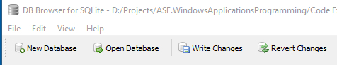
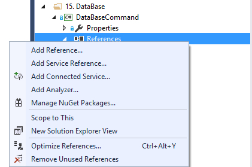
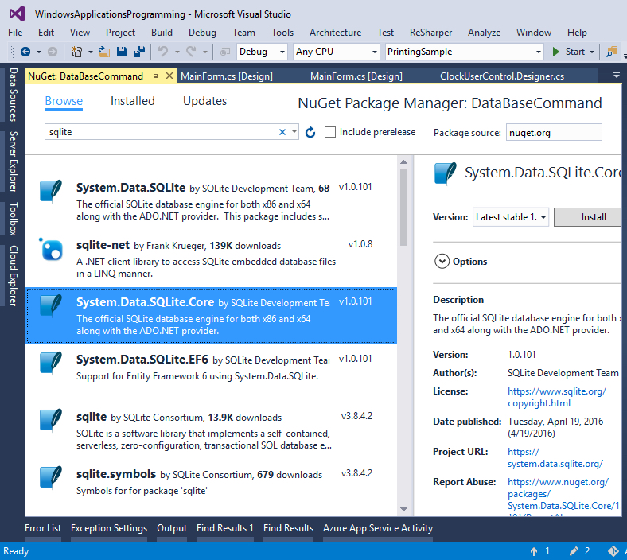
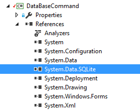

# Windows Forms – Databases - SQLite

<!-- vscode-markdown-toc -->
* 1. [Creating the database](#Creatingthedatabase)
* 2. [Connected Data Access Architecture](#ConnectedDataAccessArchitecture)
* 3. [ Disconnected Data Access Architecture](#DisconnectedDataAccessArchitecture)
* 4. [Bibliography](#Bibliography)

<!-- vscode-markdown-toc-config
	numbering=true
	autoSave=true
	/vscode-markdown-toc-config -->
<!-- /vscode-markdown-toc -->
##  1. <a name='Objectives'></a>Objectives
- perform CRUD (Create, Read, Update and Delete) operations using the connected data access approach;
- perform CRUD (Create, Read, Update and Delete) operations using the disconnected data access approach;
- working with multiple related entities;
- basic understanding of SQL Injection attacks.

##  2. <a name='Documentation'></a>Documentation
ADO.NET provides consistent access to data sources such as SQL Server and XML, and to data sources exposed through OLE DB and ODBC. Data-sharing consumer applications can use ADO.NET to connect to these data sources and retrieve, handle, and update the data that they contain.

> Further reading: https://docs.microsoft.com/en-us/dotnet/framework/data/adonet/ado-net-overview

##  3. <a name='Creatingthedatabase'></a>Creating the database

**Activity**

1. Install DB Browser for SQLite <http://sqlitebrowser.org/>  

2. Choose the option “New Database”
3. Add a new table as follows (you can also use the designer)

	```SQL
	CREATE TABLE `Participant` (
		`Id` INTEGER NOT NULL PRIMARY KEY AUTOINCREMENT UNIQUE,
		`LastName` TEXT,
		`FirstName` TEXT,
		`BirthDate` TEXT
	);
```

##  2. <a name='ConnectedDataAccessArchitecture'></a>Connected Data Access Architecture

**Activity**

> :octocat: Full source code available, check the `DatabaseCommandSQLite` sample

1. Create a copy of the “ListViewBasicSample” project and name it “DatabaseCommandSQLite”
2. Add SQLite libraries using NuGet (recommended) or directly from the website <http://system.data.sqlite.org/index.html/doc/trunk/www/index.wiki>
	1. Open the NuGet Package Manager by right clicking on the “References” node in the “Solution Explorer” window, and choosing the “Manage NuGet Packages” option, as shown below  
	
	2. Go to the “Browse” tab of the “NuGet Package Manager” and search for “sqlite”. Choose the “System.Data.SQLite.Core” package and hit the “Install” button  
	
	3. The package will be downloaded and Installed. A new reference to “System.Data.SQLite” will be automatically added to the “References” node, as shown below  
	
3. Add the database connection string, as an attribute (“ConnectionString” ) of the “MainForm” class as follows:

	```c#
	public partial class MainForm : Form
	{
		#region Attributes
		//Best practice
		//Define the connection string in the settings of the application
		//private string connectionString = Properties.Settings.Default.Database;
		private const string ConnectionString = "Data Source=database.db";
		private readonly List<Participant> _participants;
		#endregion
		
		. . .
	}
	```
4. Set the tag property for the ListViewItems as follows:

	```c#
	public void DisplayParticipants()
	{
		lvParticipants.Items.Clear();
		
		foreach (Participant participant in _participants)
		{
			var listViewItem = new ListViewItem(participant.LastName);
			listViewItem.SubItems.Add(participant.FirstName);
			listViewItem.SubItems.Add(participant.BirthDate.ToShortDateString());
			
			listViewItem.Tag = participant;
			
			lvParticipants.Items.Add(listViewItem);
		}
	}
	```
5. Add the method that will be used to insert new participants in the database
	
	```c#
	public void AddParticipant(Participant participant)
	{
		var queryString = "insert into Participant(LastName, FirstName, BirthDate)" +
							" values(@lastName,@firstName,@birthDate);  " +
							"SELECT last_insert_rowid()";

		using (SQLiteConnection connection = new SQLiteConnection(ConnectionString))
		{
			connection.Open();

			//1. Add the new participant to the database
			var command = new SQLiteCommand(queryString, connection);
			var lastNameParameter = new SQLiteParameter("@lastName");
			lastNameParameter.Value = participant.LastName;
			var firstNameParameter = new SQLiteParameter("@firstName");
			firstNameParameter.Value = participant.FirstName;
			var birthDateParameter = new SQLiteParameter("@birthDate");
			birthDateParameter.Value = participant.BirthDate;

			command.Parameters.Add(lastNameParameter);
			command.Parameters.Add(firstNameParameter);
			command.Parameters.Add(birthDateParameter);

			participant.Id = (long)command.ExecuteScalar();

			//2. Add the new participants to the local collection
			_participants.Add(participant);
		}
	}
	```
7. Change the “btnAdd_Click” event handler as follows:
	
	```c#
	private void btnAdd_Click(object sender, EventArgs e)
	{
		var lastName = tbLastName.Text;
		var firstName = tbFirstName.Text;
		var birthDate = dtpBirthDate.Value;
		
		var participant = new Participant(lastName, firstName, birthDate);
		
		try
		{
			AddParticipant(participant);
			DisplayParticipants();
		}
		catch (Exception ex)
		{
			MessageBox.Show(ex.Message);
		}
	}
	```
8. Add the method that will be used to get the existing participants from the database
		
	```c#
	public void LoadParticipants()
	{
		const string stringSql = "SELECT * FROM Participant";

		using(SQLiteConnection connection = new SQLiteConnection(ConnectionString))
		{
			connection.Open();

			var command = new SQLiteCommand(stringSql, connection);

			SQLiteDataReader sqlReader = command.ExecuteReader();
			try
			{
				while (sqlReader.Read())
				{
					_participants.Add(new Participant((long) sqlReader["Id"], (string) sqlReader["LastName"],
						(string) sqlReader["FirstName"], DateTime.Parse((string) sqlReader["BirthDate"])));
				}
			}
			finally
			{
				// Always call Close when done reading.
				sqlReader.Close();
			}
		}
	}
	```
9. Handle the Load events of the “MainForm” class as follows:
	
	```c#
	private void MainForm_Load(object sender, EventArgs e)
	{
		try
		{
			LoadParticipants();
			DisplayParticipants();
		}
		catch (Exception ex)
		{
			MessageBox.Show(ex.Message);
		}
	}
	```
10. Add the method that will be used to delete existing participants from the database
		
	```c#
	public void DeleteParticipant(Participant participant)
	{
		const string stringSql = "DELETE FROM Participant WHERE Id=@id";

		using (SQLiteConnection connection = new SQLiteConnection(ConnectionString))
		{
			connection.Open();

			//Remove from the database
			SQLiteCommand command = new SQLiteCommand(stringSql, connection);

			var idParameter = new SQLiteParameter("@id");
			idParameter.Value = participant.Id;
			command.Parameters.Add(idParameter);

			command.ExecuteNonQuery();

			//Remove from the local copy
			_participants.Remove(participant);
		}
	}
	```
11. Handle the “Delete” button as follows:
	
	```c#
	private void btnDelete_Click(object sender, EventArgs e)
	{
		if (lvParticipants.SelectedItems.Count == 0)
		{
			MessageBox.Show("Choose a participant");
			return;
		}
		
		if (MessageBox.Show("Are you sure?", "Delete participant", MessageBoxButtons.YesNo, MessageBoxIcon.Warning) == DialogResult.Yes)
		{
			try
			{
				DeleteParticipant((Participant) lvParticipants.SelectedItems[0].Tag);
				DisplayParticipants();
			}
			catch (Exception ex)
			{
				MessageBox.Show(ex.Message);
			}
		}
	}
	```
12. Why do we use command parameters instead of building the query using string concatenation instead?

 	> Read more about the SQL Injection attack at: https://docs.microsoft.com/en-us/sql/relational-databases/security/sql-injection

**Assignments (for you to try)** :video_game:

1. Implement the edit functionality in order to allow the user to modify the data, for previously entered participants
2. Try to implement an SQL Injection attack by modifing the insert query in order to use string contcatenation, instead of command parameters.
3. Allow the user to choose the competition in which the participant is going to run as shown below. Define a `Race` (RaceId: `int` or `long`, Name:`string`) class and add a property `RaceId` to the `Participant` class (the value of the property will be persisted in the database).

	

	>Note: For the complete sample (using MSAccess instead), check the "DatabaseCommandMSAccess2Entities" project in the "code samples" folder. 
4. Replace the `ListView` control used in the `MainForm` with a `DataGridView` control. Make sure that the edit and delete functionalities work correctly. 
	
	>Hint: you can either use databinding (easier, better - recommended) or you can work directly with the `Rows` property of the `DataGridView`.

	>Note: The "DatabaseCommandSQLiteDataGridView" project in the "code samples" folder uses the `DataGridView` control (databinding) and implements the delete functionality. 	

##  3. <a name='DisconnectedDataAccessArchitecture'></a> (Optional) Disconnected Data Access Architecture

**Activity**
> :octocat: Full source code available, check the `DatabaseDataAdapterSQLite` sample

1. Create a copy of the “BasicListView” project and name it “DatabaseDataAdapterSQLite”
2. Replace the “ListView” control with a “DataGrid” control (Name: dgvParticipants)
3. Modify the “MainForm” class as follows:

	```c#
	public partial class MainForm : Form
    {
	    private readonly SQLiteConnection _dbConnection ;
		private readonly SQLiteDataAdapter _dbDataAdapter;
	    private readonly DataSet _dsParticipants;

        public MainForm()
        {
	        InitializeComponent();

			//Best practice
			//Define the connection string in the settings of the application
			//var dbConnection = new SQLiteConnection(Properties.Settings.Default.Database);
			_dbConnection = new SQLiteConnection("Data Source = database.db");

			_dsParticipants = new DataSet();

	        _dbDataAdapter = new SQLiteDataAdapter();

			var selectCommand = new SQLiteCommand("SELECT Id, LastName, FirstName, BirthDate FROM Participant", _dbConnection);
	        _dbDataAdapter.SelectCommand = selectCommand;

			var deleteCommand = new SQLiteCommand(
				"DELETE FROM Participant WHERE Id = @Id", _dbConnection);
			deleteCommand.Parameters.Add(
				new SQLiteParameter("@Id",DbType.Int64, "Id"));
			_dbDataAdapter.DeleteCommand = deleteCommand;

			var insertCommand = new SQLiteCommand("INSERT INTO Participant (LastName, FirstName, BirthDate) VALUES (@LastName, @FirstName, @BirthDate);", _dbConnection);
			insertCommand.Parameters.Add(
				new SQLiteParameter("@LastName", DbType.String, "LastName"));
			insertCommand.Parameters.Add(
				new SQLiteParameter("@FirstName", DbType.String, "FirstName"));
			insertCommand.Parameters.Add(
				new SQLiteParameter("@BirthDate", DbType.String, "BirthDate"));
			_dbDataAdapter.InsertCommand = insertCommand;

			var updateCommand = new SQLiteCommand("UPDATE Participant SET LastName = @LastName, FirstName=@FirstName, BirthDate = @BirthDate WHERE Id = @Id", _dbConnection);
			updateCommand.Parameters.Add(
				new SQLiteParameter("@LastName", DbType.String, "LastName"));
			updateCommand.Parameters.Add(
				new SQLiteParameter("@FirstName", DbType.String, "FirstName"));
			updateCommand.Parameters.Add(
				new SQLiteParameter("@BirthDate", DbType.String, "BirthDate"));
			updateCommand.Parameters.Add(
				new SQLiteParameter("@Id", DbType.Int64, "Id"));
			_dbDataAdapter.UpdateCommand = updateCommand;

	        _dbDataAdapter.RowUpdated += _dbDataAdapter_RowUpdated;
		}

		#region Events
		private void MainForm_Load(object sender, EventArgs e)
		{
			try
			{
				_dbDataAdapter.Fill(_dsParticipants, "Participant");
			}
			catch (Exception ex)
			{
				MessageBox.Show(ex.Message);
			}

			//DataBinding Grid
			dgvParticipants.DataSource = _dsParticipants.Tables["Participant"];
			//dgvParticipants.Columns["Id"].Visible = false;
		}

		private void btnAdd_Click(object sender, EventArgs e)
		{
			DataRow newParticipantRow = 
				_dsParticipants.Tables["Participant"].NewRow();

			newParticipantRow["LastName"] = tbLastName.Text;
			newParticipantRow["FirstName"] = tbFirstName.Text;
			newParticipantRow["BirthDate"] = dtpBirthDate.Value;

			_dsParticipants.Tables["Participant"].Rows.Add(newParticipantRow);
		}

		private void btnPersistChanges_Click(object sender, EventArgs e)
		{
			try
			{
				_dbDataAdapter.Update(_dsParticipants, "Participant");
				//_dsParticipants.AcceptChanges();
			}
			catch (Exception ex)
			{
				MessageBox.Show(ex.Message);
			}
		}

		private void _dbDataAdapter_RowUpdated(object sender, System.Data.Common.RowUpdatedEventArgs e)
		{
			//https://msdn.microsoft.com/en-us/library/ks9f57t0%28v=vs.110%29.aspx
			if (e.StatementType == StatementType.Insert)
			{
				var getIdCommand = new SQLiteCommand("SELECT last_insert_rowid()", _dbConnection);
				e.Row["Id"] = (long)getIdCommand.ExecuteScalar();
			}
		}
		#endregion
	}
	```	
##  4. <a name='Bibliography'></a>Bibliography
- ADO.NET overview: https://docs.microsoft.com/en-us/dotnet/framework/data/adonet/ado-net-overview
- `odbc` namespace (for Microsoft Access): https://docs.microsoft.com/en-us/dotnet/api/system.data.odbc
- `sqlclient` namespace (for Microsoft SQL Server): https://docs.microsoft.com/en-us/dotnet/api/system.data.sqlclient