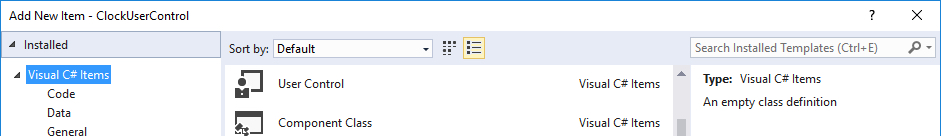
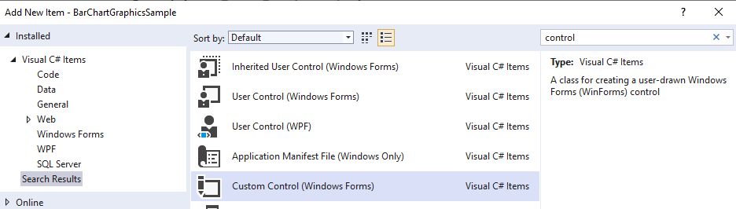
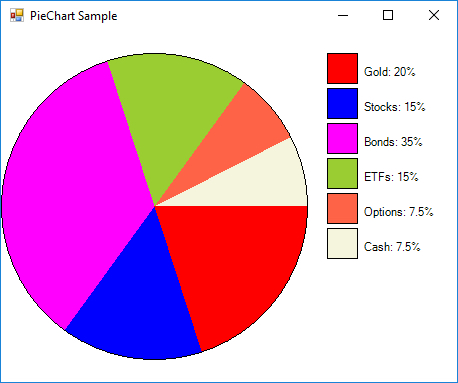
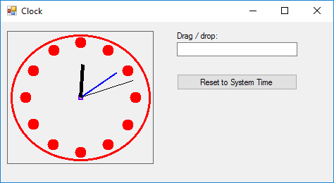

# Windows Forms – Custom Controls, Drawing

<!-- vscode-markdown-toc -->
* 1. [Objectives](#Objectives)
* 2. [Extended Controls](#ExtendedControls)
* 3. [Composite Controls](#CompositeControls)
* 4. [ Custom Controls + Drawing](#CustomControlsDrawing)
* 5. [Bibliography](#Bibliography)

<!-- vscode-markdown-toc-config
	numbering=true
	autoSave=true
	/vscode-markdown-toc-config -->
<!-- /vscode-markdown-toc -->

##  1. <a name='Objectives'></a>Objectives
- understanding the concept of custom control;
- understanding the differences between extended controls, composite controls and custom controls;
- creating a custom control and using it in a different project;
- drawing shapes and text on a windows forms control / form;

##  2. <a name='ExtendedControls'></a>Extended Controls

> :octocat: Full source code available, check the `NumericTextBoxControlSample` sample

> How to: Inherit from Existing Windows Forms Controls: https://docs.microsoft.com/en-us/dotnet/framework/winforms/controls/how-to-inherit-from-existing-windows-forms-controls

##  3. <a name='CompositeControls'></a>Composite Controls

> :octocat: Full source code available, check the `NumericTextBoxControlSample` sample

> How to: Inherit from the UserControl Class: https://docs.microsoft.com/en-us/dotnet/framework/winforms/controls/how-to-inherit-from-the-usercontrol-class



##  4. <a name='CustomControlsDrawing'></a> Custom Controls + Drawing

The Graphics class provides methods for drawing objects to the display device.

**Activity**

> :octocat: Full source code available, check the `BarChartGraphicsSample` sample

1. Create a new project of the type "Class Library (.NET Framework)" (recommended) or "Windows Forms Control Library (.NET Framework)" with the name "ChartLibrary"
2. Add a new class `BarChartValue`, defined as follows:

	```c#
	public class BarChartValue
	{
		public string Label { get; set; }
		public float Value { get; set; }

		public BarChartValue(string label, float value)
		{
			Label = label;
			Value = value;
		}
	}
	```
3. Add a new "Custom Control (Windows Forms)" and name it `BarChartControl` 
	

4. Add the `Data` property in the `BarChartControl` class

	```c#
	private BarChartValue[] _data;
	public BarChartValue[] Data
	{
		get { return _data; }
		set { _data = value; }
	}
	```
5. Modify the constructor of the `BarChartControl` class as follows:

	```c#
	public BarChartControl()
	{
		InitializeComponent();

		//redraws the chart if the control is resized
		ResizeRedraw = true;

		//default data
		Data = new[]
		{
			new BarChartValue("2015", 30), 
			new BarChartValue("2016", 80),
			new BarChartValue("2017", 40)
		};
	}
	```

6. Handle the `Paint` event for the `BarChartControl` as follows:

	```c#
	private void BarChartControl_Paint(object sender, PaintEventArgs e)
	{
		//get the drawing context
		Graphics graphics = e.Graphics;
		//get the drawing area
		Rectangle clipRectangle = e.ClipRectangle;

		//determine the width of the bars
		var barWidth = clipRectangle.Width / Data.Length;
		//compute the maximum bar height
		var maxBarHeight = clipRectangle.Height * 0.9;
		//compute the scaling factor based on the maximum value that we want to represent
		var scalingFactor = maxBarHeight / Data.Max(x=>x.Value);

		Brush redBrush = new SolidBrush(Color.Red);

		for (int i = 0; i < Data.Length; i++)
		{
			var barHeight = Data[i].Value * scalingFactor;

			graphics.FillRectangle(
				redBrush, 
				i * barWidth, 
				(float) (clipRectangle.Height - barHeight), 
				(float) (0.8 * barWidth), 
				(float) barHeight);
		}
	}	
	```
7. Add a new Windows Forms project called "BarChartGraphicsSample"
8. Add a reference to the ClassLibrary project created earlier
9. From the ToolBox drag a 'BarChartControl' to the default form in the project

**Assignments (for you to try)** :video_game:

1. Display on each bar the `Label` and `Value` properties of the corresponding `BarChartValue` object.

**Activity**

> :octocat: Full source code available, check the `PieChartGraphicsSample` sample



1. Create a new project with the name “PieChartGraphicsSample”
2. Add a new class `PieChartCategory`, defined as follows:

	```c#
	internal class PieChartCategory
	{
		public string Description { get; set; }
		
		public float Percentage { get; set; }
		
		public Color Color { get; set; }
		
		public PieChartCategory(string description, float percent, Color color)
		{
			Description = description;
			Percentage = percent;
			Color = color;
		}
	}
	```
3. Add a new "Custom Control (Windows Forms)" and name it “PieChartControl”  

4. Add the “Data “ property in the “PieChartControl” class

	```c#
	private PieChartCategory[] _data;
	public PieChartCategory[] Data {
		get { return _data; }
		set
		{
			if(_data == value)
				return;
	
			_data = value;
			
			//trigger the Paint event
			Invalidate();
		}
	}
	```

1. Modify the constructor of the “PieChartControl” class as follows:
	
	```c#
	public PieChartControl()
	{
		InitializeComponent();
	
		//redraws if resized
		ResizeRedraw = true;
		
		//Default data
		Data = new[]
		{
			new PieChartCategory("Category 1", 20, Color.Red),
			new PieChartCategory("Category 2", 80, Color.Blue)
		};
	}
	```
2. Handle the “Paint” event for the “PieChartControl” as follows:

	```c#
	private void PieChartControl_Paint(object sender, PaintEventArgs e)
	{
		//width reserved for displaying the legend
		int legendWidth = 150;
		
		//get the drawing context
		Graphics graphics = e.Graphics;
		//get the drqwing area
		Rectangle clipRectangle = e.ClipRectangle;
		
		//compute the maximum radius
		float radius = Math.Min(clipRectangle.Height, clipRectangle.Width - legendWidth) / (float)2;
		
		//determine the center of the pie
		int xCenter = (clipRectangle.Width - legendWidth) / 2;
		int yCenter = clipRectangle.Height / 2;
		
		//determine the x and y coordinate of the pie
		float x = xCenter - radius;
		float y = yCenter - radius;
		
		//determine the width and the height
		float width = radius * 2;
		float height = radius * 2;
		
		//draw the pie sectors
		float percent1 = 0;
		float percent2 = 0;
		for (int i = 0; i < Data.Length; i++)
		{
			if (i >= 1)
				percent1 += Data[i - 1].Percentage;
				
			percent2 += Data[i].Percentage;
			
			float angle1 = percent1 / 100 * 360;
			float angle2 = percent2 / 100 * 360;
			
			Brush b = new SolidBrush(Data[i].Color);
			
			graphics.FillPie(b, x, y, width, height, angle1, angle2 - angle1);
		}
		
		//draw the pie contour
		Pen pen = new Pen(Color.Black);
		graphics.DrawEllipse(pen, x, y, width, height);
		
		//draw the chart legend
		float xpos = x + width + 20;
		float ypos = y;
		for (int i = 0; i < Data.Length; i++)
		{
			Brush b = new SolidBrush(Data[i].Color);
			graphics.FillRectangle(b, xpos, ypos, 30, 30);
			graphics.DrawRectangle(pen, xpos, ypos, 30, 30);
			Brush b2 = new SolidBrush(Color.Black);
			graphics.DrawString(Data[i].Description + ": " + Data[i].Percentage + "%",
			Font, b2,
			xpos + 35, ypos + 12);
			ypos += 35;
		}
	}
	```
3. Add the “PieChartControl” to the “MainForm” (using the Toolbox)
4. Handle the “Load” event for the “MainForm” as follows:

	```c#
	private void MainForm_Load(object sender, System.EventArgs e)
	{
		PieChartCategory[] pieCategories = {
			new PieChartCategory("Gold", 20, Color.Red),
			new PieChartCategory("Stocks", 15, Color.Blue),
			new PieChartCategory("Bonds", 35, Color.Magenta),
			new PieChartCategory("ETFs", 15, Color.YellowGreen),
			new PieChartCategory("Options", (float) 7.5, Color.Tomato),
			new PieChartCategory("Cash", (float) 7.5, Color.Beige)
		};
		
		pieChartControl1.Data = pieCategories;
	}
	```
	
**Activity**

> :octocat: Full source code available, check the `ClockControlSample` and `ClockControlAppSample` samples



##  5. <a name='Bibliography'></a>Bibliography
- Windows Forms Control Development Basics: https://docs.microsoft.com/en-us/dotnet/framework/winforms/controls/windows-forms-control-development-basics
- How to: Inherit from Existing Windows Forms Controls: https://docs.microsoft.com/en-us/dotnet/framework/winforms/controls/how-to-inherit-from-existing-windows-forms-controls
- How to: Inherit from the UserControl Class: https://docs.microsoft.com/en-us/dotnet/framework/winforms/controls/how-to-inherit-from-the-usercontrol-class
