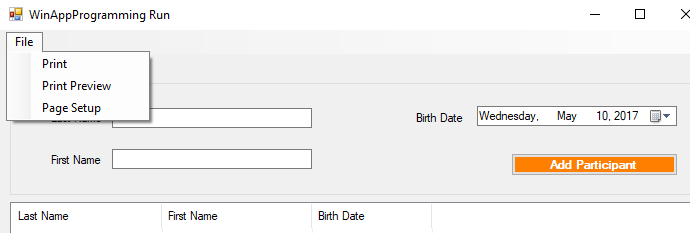

# Windows Forms – Printing

**Activity**

> :octocat:  Sample Code available at <http://online.ase.ro> – “PrintingRecordsSample” Sample

1. Create a copy of the “ListViewBasicSample” project and name it “PrintingRecordsSample”
2. Add a `MenuStrip` control with the options shown in the following screenshot
    
3. From the ToolBox add a `PrintDocument` and a `PageSetupDialog` control
4. Handle the `Click` event on the "PageSetup" button as follows

    ```c#
    private void btnPageSetup_Click(object sender, EventArgs e)
    {
        pageSetupDialog.Document = printDocument;
        pageSetupDialog.PageSettings = printDocument.DefaultPageSettings;

        if (pageSetupDialog.ShowDialog() == DialogResult.OK)
            printDocument.DefaultPageSettings = pageSetupDialog.PageSettings;
    }
    ```
5. Handle the `PrintPage` event of the `PrintDocument` control as follows
    ```c#
    private void printDocument_PrintPage(object sender, System.Drawing.Printing.PrintPageEventArgs e)
    {
        // Initialize the font to be used for printing.
        Font font = new Font("Microsoft Sans Serif", 24);

        var pageSettings = printDocument.DefaultPageSettings;
        // Initialize local variables that contain the bounds of the printing 
        // area rectangle.
        var intPrintAreaHeight = pageSettings.PaperSize.Height - pageSettings.Margins.Top - pageSettings.Margins.Bottom;
        var intPrintAreaWidth = pageSettings.PaperSize.Width - pageSettings.Margins.Left - pageSettings.Margins.Right;

        // Initialize local variables to hold margin values that will serve
        // as the X and Y coordinates for the upper left corner of the printing 
        // area rectangle.
        var marginLeft = pageSettings.Margins.Left;
        // X coordinate
        var marginTop = pageSettings.Margins.Top;
        // Y coordinate

        // If the user selected Landscape mode, swap the printing area height 
        // and width.
        if (printDocument.DefaultPageSettings.Landscape)
        {
            var intTemp = intPrintAreaHeight;
            intPrintAreaHeight = intPrintAreaWidth;
            intPrintAreaWidth = intTemp;
        }

        const int rowHeight = 40;
        var columnWidth = intPrintAreaWidth / 3;

        // Instantiate the StringFormat class, which encapsulates text layout 
        // information (such as alignment and line spacing), display manipulations 
        // (such as ellipsis insertion and national digit substitution) and OpenType 
        // features. Use of StringFormat causes MeasureString and DrawString to use
        // only an integer number of lines when printing each page, ignoring partial
        // lines that would otherwise likely be printed if the number of lines per 
        // page do not divide up cleanly for each page (which is usually the case).
        // See further discussion in the SDK documentation about StringFormatFlags.
        StringFormat fmt = new StringFormat(StringFormatFlags.LineLimit);
        fmt.Trimming = StringTrimming.EllipsisCharacter;

        var currentY = marginTop;
        while(_currentParticipantIndex < _participants.Count)
        {
            //Reset the horizontal drawing coordinate
            var currentX = marginLeft;

            //Draw the border of the cell
            e.Graphics.DrawRectangle(
                Pens.Black, 
                currentX, 
                currentY, 
                columnWidth, 
                rowHeight);
            //Draw the text in the cell
            /*e.Graphics.DrawString(
                _participants[i].FirstName,
                font,
                Brushes.Black,
                currentX,
                currentY,
                fmt);*/
            // By specifying a LayoutRectangle, we are forcing the text into a specific area, with automatic word wrapping and other features controllable through the StringFormat parameter
            e.Graphics.DrawString(
                _participants[_currentParticipantIndex].LastName,
                font,
                Brushes.Black,
                new RectangleF(currentX, currentY, columnWidth, rowHeight),
                fmt);
            //Update the horizontal drawing coordinate
            currentX += columnWidth;

            e.Graphics.DrawRectangle(
                Pens.Black,
                currentX,
                currentY,
                columnWidth,
                rowHeight);
            e.Graphics.DrawString(
                _participants[_currentParticipantIndex].FirstName,
                font,
                Brushes.Black,
                currentX,
                currentY,
                fmt);
            currentX += columnWidth;

            e.Graphics.DrawRectangle(
                Pens.Black,
                currentX,
                currentY,
                columnWidth,
                rowHeight);
            e.Graphics.DrawString(
                _participants[_currentParticipantIndex].BirthDate.ToShortDateString(),
                font,
                Brushes.Black,
                currentX,
                currentY,
                fmt);

            //Update the participant index
            _currentParticipantIndex++;
            //Update the vertifcal drawing coordinate
            currentY += rowHeight;

            // HasMorePages tells the printing module whether another PrintPage event should be fired.
            if (currentY + rowHeight > intPrintAreaHeight)
            {
                e.HasMorePages = true;
                break;
            }
        }
    }
    ```
6. Handle the `BeginPrint` event of the `PrintDocument` control as follows
    ```c#
    private void printDocument_BeginPrint(object sender, System.Drawing.Printing.PrintEventArgs e)
    {
        _currentParticipantIndex = 0;
    }
    ```
7. Handle the `Click` event on the "PrintPreview" button, as follows
    ```c#
    private void btnPrintPreview_Click(object sender, EventArgs e)
    {
        try
        {
            printPreviewDialog.Document = printDocument;
            printPreviewDialog.ShowDialog();
        }
        catch (Exception)
        {
            MessageBox.Show("An error occurred while trying to load the document for Print Preview. Make sure you currently have access to a printer. A printer must be connected and accessible for Print Preview to work.");
        }
    }
    ```
8. Handle the `Click` event on the "Print" button as follows
    ```C#
    private void btnPrint_Click(object sender, EventArgs e)
    {
        printDialog.Document = printDocument;
        if (printDialog.ShowDialog() == DialogResult.OK)
            printDocument.Print();
    }
    ```
    
**Assignment (for you to try)**
1. Add a header at the begging of the printed report
2. Repeat the header at the beginning of each new page
 
**Activity**

> :octocat:  Sample Code available at <http://online.ase.ro> – “PrintingLongTextSample” Sample

