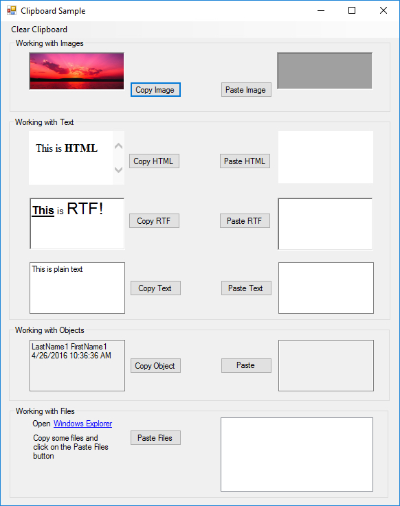
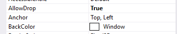

# Windows Forms – Clipboard, Drag and Drop

##	 Contents

1. [clipboard](#Clipboard)
2. [Drag and Drop](#drag-and-drop)


## <a name="clipboard"></a>Clipboard
**Activity**

 Sample Code available at <http://online.ase.ro> – “ClipboardSample” Sample

1. Create a new project with the name “ClipboardSample”
2. Create the following UI:  

3. Handle the Click event on the “Copy Text” button as follows:    
	
	```c#
	//Copy text from text box onto the clipboard
	Clipboard.SetText(tbCopy.Text);
	```
4. Handle the Click event on the “Paste Text” button as follows:
	
	```c#
	//If clipboard has text, paste it into the text box
	if (Clipboard.ContainsText())
	{
		tbPaste.Text = Clipboard.GetText();
	}
	else
	{
		MessageBox.Show("Clipboard does not contain any text");
	}
	```
5. Check the rest of the sample online


## <a name="drag-and-drop"></a>Drag and Drop

Further reading: <https://msdn.microsoft.com/en-us/library/aa984430%28v=vs.71%29.aspx>

**Activity**

 Sample Code available at <http://online.ase.ro> – “DragDropSample” Sample 

1. Create a new project with the name “DragDropSample”
2. Create the UI shown below  

3. Set the “AllowDrop” property of the ListView to true  

4. Handle the “MouseDown” event for the TextBox as follows:
	
	```c#
	textBox1.DoDragDrop(textBox1.Text, DragDropEffects.Copy);
	```
5. Handle the “DragEnter” event for the ListView as follows:

	```c#
	// Display some information about the DragDrop information in the
	// richTextBox1 control to show some of the information available.
	richTextBox1.Text = "Allowed Effect: " + e.AllowedEffect +
	"\r\nAvailable Formats:\r\n";
	
	// Data may be available in more than one format, so loop through
	// all available formats and display them in richTextBox1.
	foreach (string availableFormat in e.Data.GetFormats(true))
	{
		richTextBox1.Text += "\t" + availableFormat + "\r\n";
	}
	
	// This control will use any dropped data to add items to the listbox.
	// Therefore, only data in a text format will be allowed. Setting the
	// autoConvert parameter to true specifies that any data that can be
	// converted to a text format is also acceptable.
	if (e.Data.GetDataPresent(DataFormats.Text, true))
	{
		// Some controls in this sample allow both Copy and Move effects.
		// If a Move effect is allowed, this implementation assumes a Move
		// effect unless the CTRL key was pressed, in which case a Copy
		// effect is assumed. This follows standard DragDrop conventions.
		if ((e.AllowedEffect & DragDropEffects.Move) == DragDropEffects.Move && (e.KeyState & CtrlKey) != CtrlKey)
		{
			// Show the standard Move icon.
			e.Effect = DragDropEffects.Move;
		}
		else
		{
			// Show the standard Copy icon.
			e.Effect = DragDropEffects.Copy;
		}
	}
	```
6. Handle the “DragDrop” event for the ListView as follows:
	
	```c#
	/// <summary>
	/// The DragDrop event of the target control fires when a drop actually occurs over
	/// the target control. This is where the data being dragged is actually processed.
	///
	/// This event will fire only if the AllowDrop property of the target control has
	/// been set to true.
	/// </summary>
	/// <param name="sender">The source of the event.</param>
	/// <param name="e">A DragEventArgs that contains the event data.</param>
	private void listBox1_DragDrop(object sender, DragEventArgs e)
	{
		if (e.Data.GetDataPresent(DataFormats.Text, true))
		{
			// Create the list item using the data provided by the source control.
			listBox1.Items.Add(e.Data.GetData(DataFormats.Text));
		}
	}
	```